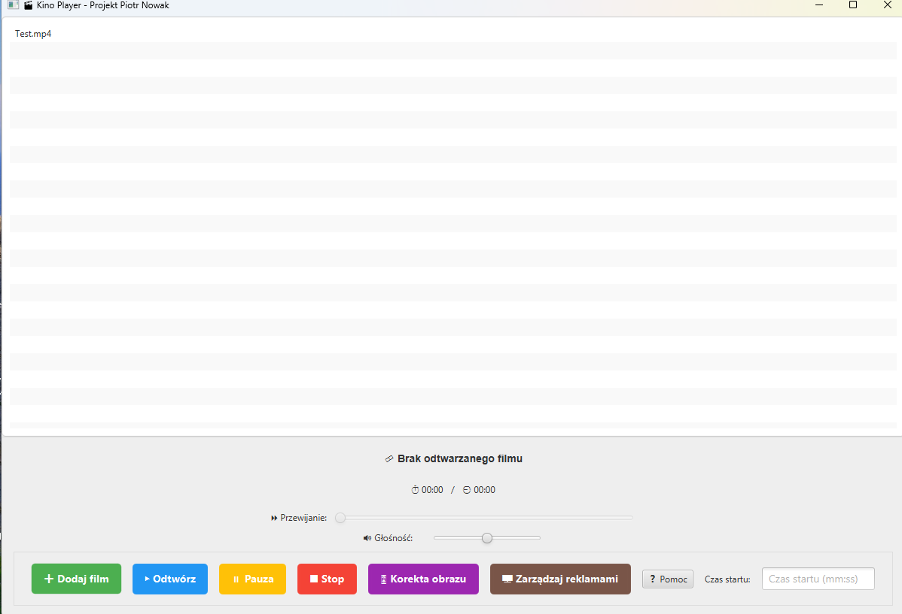
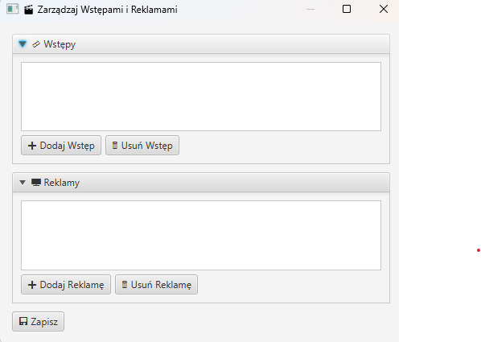
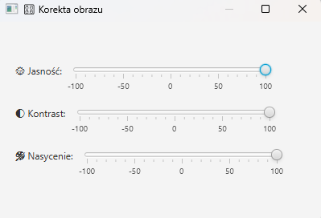

# 🎬 Kino Player – Odtwarzacz Filmów dla Kin

Aplikacja desktopowa do wyświetlania filmów, reklam i wstępów, stworzona z myślą o zastosowaniu w salach kinowych lub pokazach multimedialnych.  
Zbudowana w **Java 17** z użyciem **JavaFX** i **VLCJ** (VLC Java bindings).

---

## 🖼️ Interfejs Aplikacji

| Ekran główny | Dodawanie reklam | Korekta obrazu |
|-------------|-------------------|----------------|
|  |  |  |

---

## 🔧 Funkcjonalności

### 🎥 Główne funkcje

- **Dodaj Film** – wybierz główny film do odtwarzania
- **Odtwórz** – rozpoczyna seans razem z reklamami i wstępem
- **Pauza / Stop** – kontrola odtwarzania

### 🎛️ Ustawienia i kontrola

- **Korekta obrazu** – reguluj:
  - jasność
  - kontrast
  - nasycenie
  - kolory

- **Głośność** – regulacja za pomocą suwaka  
- **Przewijanie filmu** – przewiń do dowolnego momentu

### 📺 Zarządzanie treściami

- **Wstęp** – krótki film przed głównym filmem
- **Reklamy** – możliwość odtwarzania reklam przed wstępem lub filmem
- **Czas startu** – możliwość rozpoczęcia filmu od określonego momentu (np. `02:35`)

---

## 🛠️ Technologie

| Technologia | Wersja |
|-------------|--------|
| Java        | 17     |
| JavaFX      | ✅     |
| VLCJ        | ✅     |
| VLC Media Player | wymagany |

---

## 🚀 Uruchomienie

1. Zainstaluj [VLC Media Player](https://www.videolan.org/vlc/)
2. Zainstaluj Java 17+
